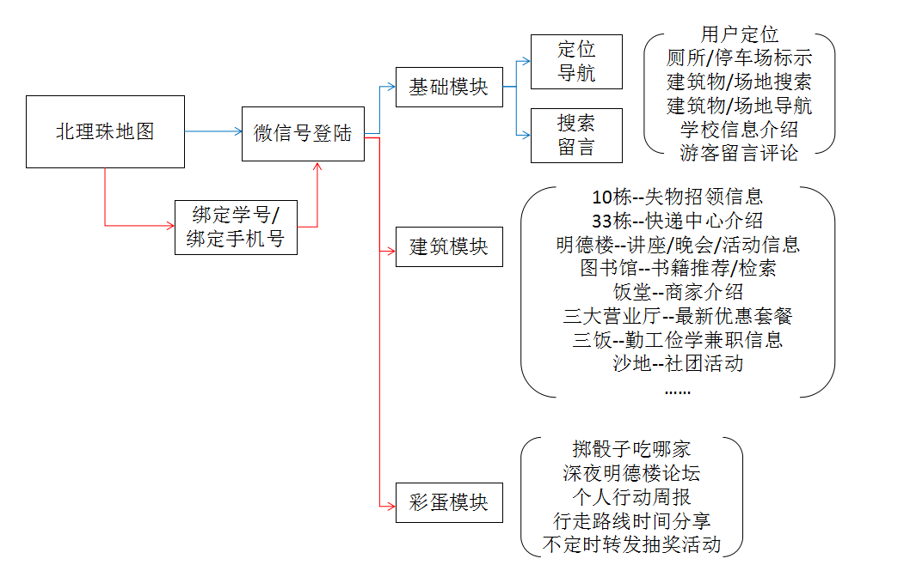
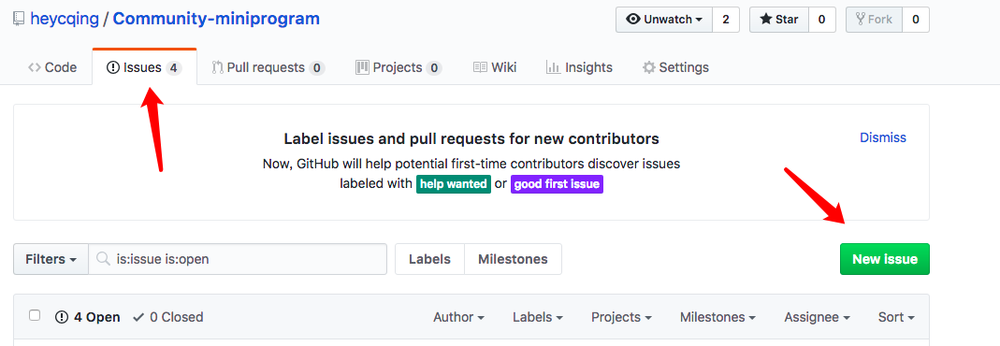

# Community-applet
小程序，基于社区建设，地图寻物类产品，同时并有后台内容管理。

> 目录：

1. [功能需求](#功能需求)
2. [开发人员必看](#开发人员必看)

## 功能需求

> 带 ❗️ 为最优先级，现在看到的是基本雏形需求,  
> 思路是先创建基本模块，然后对其他某个特色进行改造.

### 整体功能需求;
;

### 对于运营人员进行的功能改造
- [ ] ❗️ 进行后台系统开发
    - [ ] 主要针对运营人员的自主更改**信息通知**

### 小程序前端;
- [✔️ ] ❗️ 基于小程序地图类展示；
    - [ ] ❗️ 昼夜地图样式更换;
    - [ ] ❗️ 添加各个标志建筑物;
    - [ ] ❗️ 自我定位，地点导航;
    - [ ]    个人路线记录;
    - [ ]    一键切换界面风格颜色;
- [ ] ❗️ 个人中心
    - [ ] 基本微信信息展示;
- [ ] 学校信息展示;
    - [ ] 基本信息展示;
- [ ] ❗️ 论坛基础模块;
    - [ ] 信息展示;
    - [ ] 信息发布;
    - [ ] 信息评论;
- [ ] 活动信息通知基础模块;
    - [ ] 信息展示；
- [ ] 彩蛋
    - [ ] 深夜话题;
    - [ ] 个人行动周报展示;
    
- [ ] 前端埋点，在小程序数据平台；

### 后台管理前端;
- [ ] 信息录入
    - [ ] 学校信息录入;
    - [ ] 活动通知信息录入;

### 小程序后端;
- [ ] ❗️ 绑定个人信息;
    - [ ] 获取当前微信号;
- [ ] ❗️ 各模块数据互动;
    - [ ] 学校基本信息;

#### 后期针对前端编写的一些优化
- [ ] 使用sass进行优化开发；
- [ ] 使用前端构建工具打包；

## 开发人员必看

> 为了方便开发小伙伴协作 
> 有一些以下的建议

- 开发工具
    + 前端最好使用**VScode编辑器开发代码，使用微信开发者工具查看效果**;
    + 使用 `vscode` 记得帮自己编辑器安装 **小程序插件** -----> `minapp`;
- 提交代码
    + 每人有一个自己 `GitHub` 账号;
    + **一定一定要使用** `git` 来提交代码;
- 遇到 bug 或者 问题一定要提 issues
     
